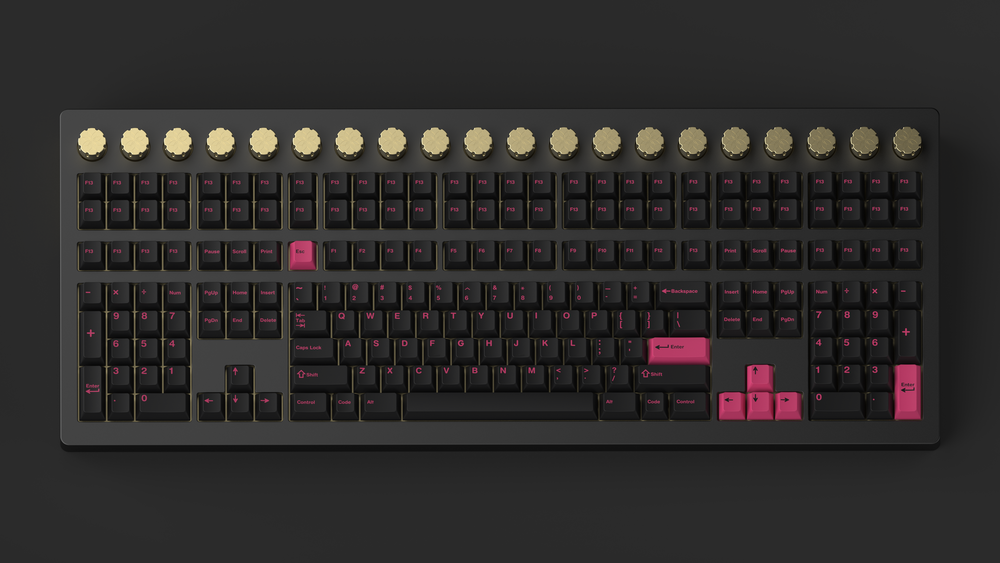

# From Mac to Thinkpad
2020 Macbook Air with M1 chips, my first computer used in univserity. There is three reasons I brought it, light weight, no fans and long battery life. But surprisingly, I discover that they are no gaming changer when I get into univserity.

There is charger everywhere in univserity library, I don't often move my computer, and I don't have heavier work on my computer.

Switching is not correct in my situation, I don't sold my Macbook, instead I brough a second hand Thinkpad x1 carbon 6th 2019. Nevertheless, I haven't used my Macbook three month ago. 

The reason I starting using thinkpad is so silly. After using Macbook for 9 months at univserity, I start to play with my keyboard, try different keyboard layout, also designed my own keyboard layout, I use [Karabiner-Elements](https://karabiner-elements.pqrs.org/) and [Goku](https://github.com/yqrashawn/GokuRakuJoudo) to config Karabiner Elements JSON file. Still there are some limitations on mac when remapping keys. Then, I discovered [kmonad](https://github.com/kmonad/kmonad), which seems to be more powerful, more free, and more structured syntax when compare to terrible JSON indention. Sadly, I found kmonad do not work on my Macbook, and it seems to work better on Linux(I still don't know the answer until now)?

After the x1 carbon reached, I install Linux distribution and then kmonad immediately, Kmonad work perfect on linux! **The silly fact is I have stopped tweaking my keyboard layout, I drop all the complex layer after using kmoand for a whole**. 

# Switching gap
No gap exist when switching, because I sedomly use Mac specified application, most of my favourite applications are cross platform, or have web version. Some application like mail and pdf editor are quite different on Linux and Macos, nevertheless, there is full documeted guide availible on univserity website. They are not an issue. Moreoever, most of the time I found myself living in browser, there will not be any significant difference in sense of user experience between Linux and Macos, instead of switching From Chrome to firefox. **Google Chrome look like second class on linux, while Firefox have gesture supporting and smooth scrolling out of the box**, Google Chrome haven't come with gesture on my Linux distribution. But still, they are all fine.

# Habbits Change after on Thinkpad
Switching has helped me discovering and changein my daily computer using habbits and my philosophy of desktop environment.

## From messay virtual desktop to organized workspace
I had one bad habbit on Macos, I give every application a single virtual desktop, making switching application difficult. Suffering from sliding between virtual desktop or type the names of applications on spotlight search. Because of the implmentaton difference on GNOME and Macos, the workspace(equivalent to Macos virtual desktop) icon is so small, forcing me not to give one workspace per application. Since often I can't memorize where are the applications, and it is difficult to look for the application on the tiny workspace icon. Nevertheless, I finally found the right usage of workspace, group related windows in the same workspace. I cannot count how much energy have been waste on finding the right location of the wanted applications.

## From tilling windows fans to floating windows fans
Before doing meaningful stuff on computer, we first make ourself look cool, where 99% of time tweaking the desktop environment, remaining 1% doing real stuff.Tilling windows look cool, like hacker sitting in front of multiple screens. I use [yabai](https://github.com/koekeishiya/yabai) on mac, before I try linux I have seen a lot of tilling windows manager screenshots sharing. They are really cool. But, most of the tilling windows manager are keyboard oriented, while the keyboard size of laptop are usually small, which mean I have to press keys with modifiers together, at the beginning, I am fine, but after a while, my little pinky finger suffer. I have rarely at the situation that have to switch between windows, of course no need for dynamic management of windows. I find floating windows is a more intuitive way to manage windows, and pinky-friendly.

## From 40% keyboard fans to 87% to 100% to 200%?
40% keyboard look cool, it hold you hand in four main rows, so it is more efficient. Um..., that how I used to be though about 40% keyboard, while saving thousand of miles finger move, I have to press every special symbols and numbers by modifiers, hold many key together, untypable if I move to new keyboard or new laptop. Currently I don't get the philosophy of low profile keyboard, instead I prefer double keyboard now. Literaly high profile keyboard, 180% keyboard. Those extra keys are used as marcos. I saved those handy shortcut combination into single keys, like I have map "7" on numpad as "C-c C-t C-v enter", "4" on numpad as my univserity mail address. I am so naive that I have implmented a 40% keyboard on Macbook keyboard, leaving the number rows unused HAHA.

(Wombat 200% keyboard)
